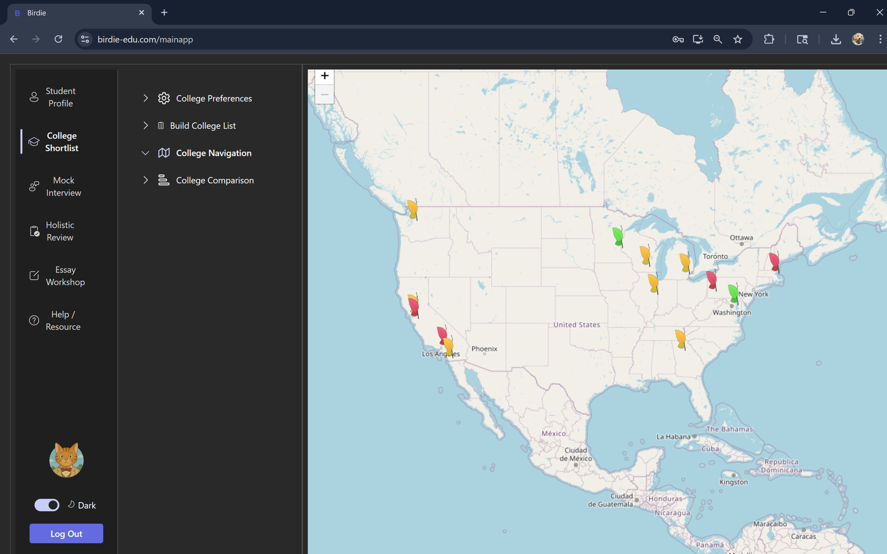
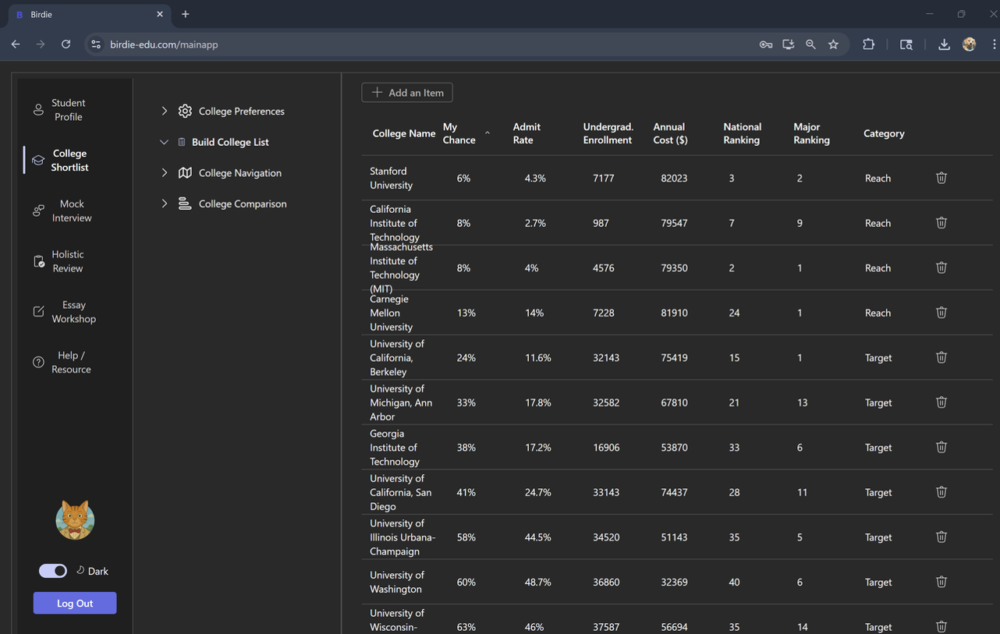
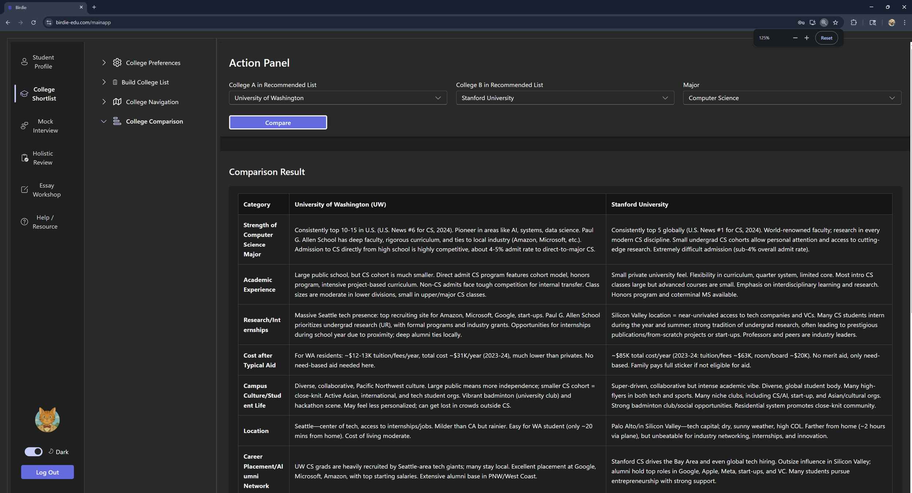
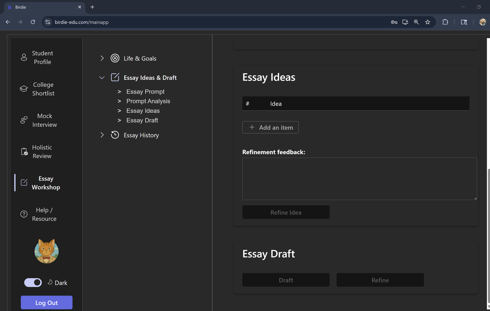
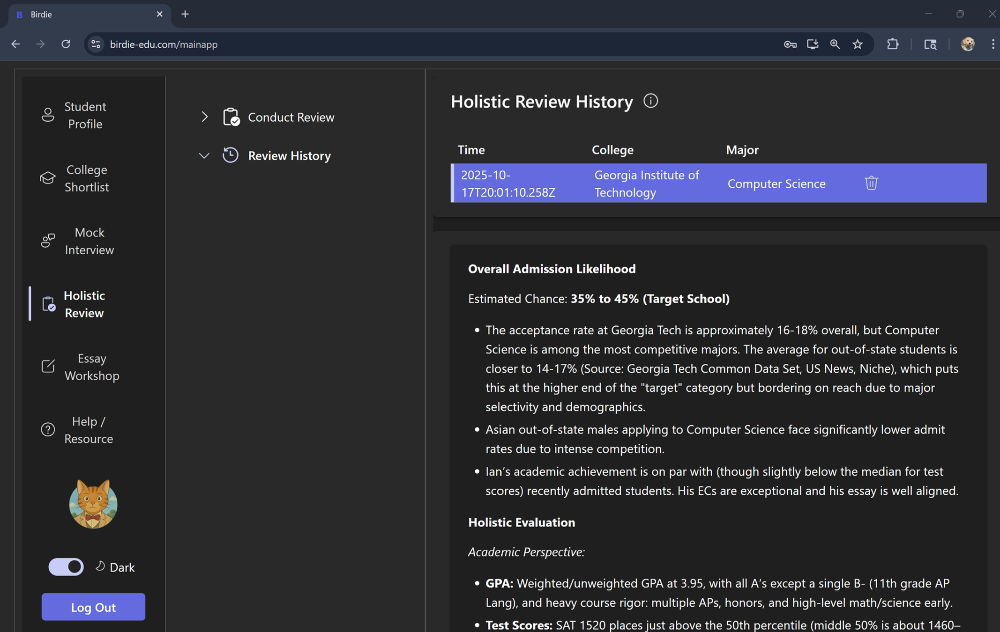
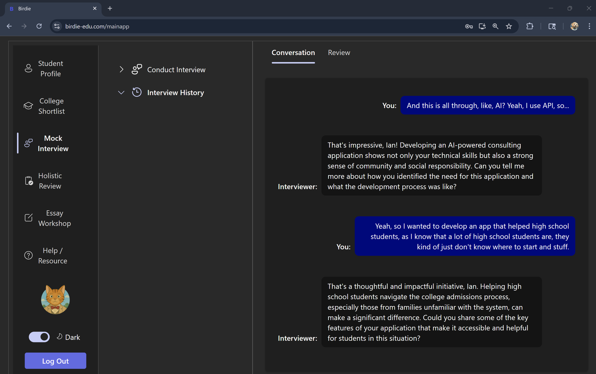
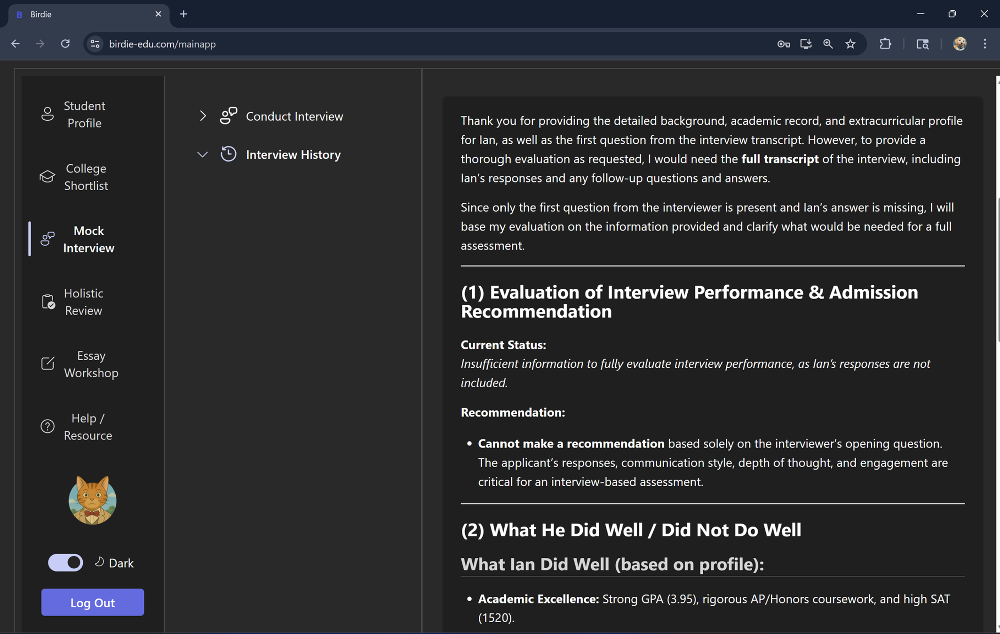

# Pinnacle

Pinnacle is the frontend for an AI-powered college counseling application. It provides the user interface for students to manage their academic profile, college preferences, essays, activities, honors, test scores, and AI-assisted counseling workflows.

This repository works together with:
* [`pinnacle_server`](https://github.com/ianjia/pinnacle_server): Node.js/Express API gateway
* [`pinnacle_ai_backend`](https://github.com/ianjia/pinnacle_ai_backend): FastAPI AI backend

## Features

* Student account login and protected routes
* Main college counseling dashboard
* Admin page support
* Password reset flow
* AI-assisted college application guidance
* Essay, activity, honor, GPA, course, test score, and profile-related UI
* React Router based navigation
* Redux-based client state management
* Fluent UI based components

## Overall Architecture

Pinnacle is split into three separate repositories. The `pinnacle` repo contains the React/TypeScript frontend that users interact with in the browser. It sends requests to `pinnacle_server`, which works as the main API gateway. The API gateway handles user authentication, JWT protection, account-related flows, database access, and routes requests to the correct backend service. For AI-heavy features, `pinnacle_server` calls `pinnacle_ai_backend`, a FastAPI service that runs the college counseling workflows, essay support, student profile analysis, interview support, and other AI-powered features.

```text
+---------------------------+
|        pinnacle           |
|  React + TypeScript UI    |
|                           |
|  - Student dashboard      |
|  - Essay/profile UI       |
|  - Login/reset pages      |
+-------------+-------------+
              |
              | HTTP API calls
              v
+---------------------------+
|     pinnacle_server       |
|  Node.js + Express API    |
|                           |
|  - Authentication/JWT     |
|  - User/account APIs      |
|  - MySQL access           |
|  - API gateway routing    |
|  - Task progress updates  |
+-------------+-------------+
              |
              | Internal API calls
              v
+---------------------------+
|  pinnacle_ai_backend      |
|  Python + FastAPI service |
|                           |
|  - AI counseling logic    |
|  - Essay support          |
|  - Interview workflows    |
|  - Student data analysis  |
|  - OpenAI integration     |
+-------------+-------------+
              |
              v
+---------------------------+
| External services / data  |
|                           |
|  - OpenAI API             |
|  - MySQL database         |
+---------------------------+
```

In short, `pinnacle` owns the user experience, `pinnacle_server` owns authentication and client-facing API coordination, and `pinnacle_ai_backend` owns the AI-powered counseling logic.

## Tech Stack (for this client repo)

* React
* TypeScript
* Redux Toolkit
* React Router
* Fluent UI
* Axios
* React Markdown
* Leaflet

## Project Structure

```text
src/
  App.tsx                       # Main route definitions
  auth/                         # Protected/admin route logic
  components/                   # Main app components
  home-page/                    # Start, login, admin, password reset pages
  store/                        # Redux store and slices
```

## Related Services

The frontend talks to the API gateway:

```text
pinnacle  --->  pinnacle_server  --->  pinnacle_ai_backend
React UI        Express API          FastAPI AI service
```

## Getting Started

### 1. Clone the repository

```bash
git clone https://github.com/ianjia/pinnacle.git
cd pinnacle
```

### 2. Install dependencies

```bash
npm install
```

### 3. Configure backend URL

Make sure the frontend points to the running `pinnacle_server` service.

For local development, the API gateway usually runs on a local port such as `4000`.

### 4. Start the development server

```bash
npm start
```

Open:

```text
http://localhost:3000
```

## Available Scripts

### `npm start`

Runs the app in development mode.

### `npm run build`

Builds the app for production into the `build` folder.

### `npm test`

Runs the test runner.

## Development Notes

Before using the full app locally, make sure both backend services are running:

1. Start `pinnacle_ai_backend`
2. Start `pinnacle_server`
3. Start this frontend app

## Repository Role

This repo contains only the client-side application. Authentication, database access, and AI logic are handled by the backend repositories.

## App Screenshots

<table>
  <tr>
    <td></td>
    <td></td>
  </tr>
  <tr>
    <td></td>
    <td></td>
  </tr>
  <tr>
    <td></td>
    <td></td>
  </tr>
  <tr>
    <td></td>
    <td></td>
  </tr>
</table>
